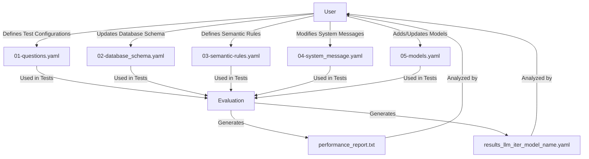

# 🚀 Setting Up Your Tests

Welcome! This guide will help you configure, run, and analyze tests for language models (LLMs) in this project. Let’s make your evaluation process smooth and insightful! ✨

## Solution Architecture



This diagram illustrates how the user interacts with the YAML files to define test configurations, which are then processed by evaluation scripts to generate performance reports for analysis.

---

## 📝 Testing Procedure Overview


### 1️⃣  | **Define Test Configuration**

Start by specifying which models, questions, and datasets you want to evaluate. Edit the relevant YAML files in the `results` directory:

- **`01-questions.yaml`**: Add or update questions, including their IDs, text, and expected outputs.

enumerate the questions you want to test. You need to provide:

- the user question in natural language,
- the SQL query that you expect to be generated,
- the tables used in the query.

Example of a question definition in `01-questions.yaml`:
```yaml
  - question_number: 1
    user_question: |
      Which customers from the 'BUILDING' market segment placed more than 10 orders in 1996? Order by total order value descending.
    sql_query: |
      SELECT
          c.c_custkey AS customer_id,
          c.c_name    AS customer_name,
          COUNT(o.o_orderkey) AS num_orders,
          SUM(o.o_totalprice) AS total_amount
      FROM customer c
      JOIN orders o ON c.c_custkey = o.o_custkey
      WHERE c.c_mktsegment = 'BUILDING'
        AND YEAR(o.o_orderdate) = 1996
      GROUP BY c.c_custkey, c.c_name
      HAVING COUNT(o.o_orderkey) > 10
      ORDER BY total_amount DESC;
    tables_used:
      - "customer"
      - "orders"
```

- **`02-database_schema.yaml`**: Ensure the database schema matches your test requirements.

This file should include the database schema used for the queries. It is good for the model to include the primary keys, constraints, and foreign keys of the tables used in the queries.

Example of a database schema definition in `02-database_schema.yaml`:
```yaml
tables:
  - name: "region"
    script: |
      create table region (
          r_regionkey integer not null,
          r_name char(25) not null,
          r_comment varchar(152),
          primary key (r_regionkey)
      );

  - name: "nation"
    script: |
      create table nation (
          n_nationkey integer not null,
          n_name char(25) not null,
          n_regionkey integer not null,
          n_comment varchar(152),
          primary key (n_nationkey)
      );
```


- **`03-semantic-rules.yaml`**: Define or refine rules for evaluating the correctness of model responses.

This data goes to the system message used in the LLM calls. This is the place to influence the model on best practices, coding standards, and specific SQL dialects. Text is free-form, markdonw is fantastic for LLMs.

Example of semantic rules in `03-semantic-rules.yaml`:
```yaml
## CODING RULES  
• Include **id + name** for every entity mentioned; drop whole blocks else.  
• columns order: Entity_blocks, Time, Metrics
• Preserve column order exactly.  
• Use snake_case aliases; SQL keywords UPPER.  
• `GROUP BY` every non-aggregated canonical column.  
• Map: `COUNT(*)`→num_orders, `SUM(o_totalprice)`→total_amount.  
• New metrics: alias + append after existing ones.  
• Ensure the query runs without alias/group errors.


```

- **`04-system_message.yaml`**: Adjust system-level prompts or instructions as needed.
- **`05-models.yaml`**: Select which models to test and configure their settings (e.g., enable/disable, cost parameters).

This file contains the list of models to be tested. You can add new models or modify existing ones. Each model should have a name, description, and cost parameters.

Example of a model definition in `05-models.yaml`:
```yaml
models_configs:
  - id: MSDN_CORP
    enabled: true
    models:
      - name: DeepSeek-V3-0324
        cost_input_tokens_EUR_1K:  0.00114
        cost_output_tokens_EUR_1K: 0.00456
      - name: gpt-4o
        cost_input_tokens_EUR_1K:  0.00250
        cost_output_tokens_EUR_1K: 0.01000
      - name: gpt-4o-mini
```

The model endpoint, and the api key must be added to the `.env` file.
If you named the model as MSDN_CORP, you should add the following lines to your `.env` file:

```plaintext
ENDPOINT_MSDN_CORP=https://api.example.com/v1/models
API_KEY_MSDN_CORP=your_api_key_here
```

### 2️⃣  | **Execute Tests**

Run the provided test scripts to evaluate your configurations. These scripts will:

- Process your YAML definitions.
- Interact with the selected models.
- Collect performance metrics and generate result files (e.g., `results_llm_[iter]_{model_name}.yaml` and `performance_report.txt`).

### 3️⃣  | **Analyze Results**

Review the generated reports to assess model performance:

- Examine the YAML result files for detailed metrics on each query and model.
- Use `performance_report.txt` to compare models across key metrics such as accuracy, speed, and cost.
- Identify strengths, weaknesses, and areas for improvement based on the data.

By following these steps, you can systematically evaluate and improve your language models.

---

## 📊 Results & Analysis

After running tests, results appear in the `results` directory. These include:

#### Generated YAML Files
| File | Description |
|------|-------------|
| `results_llm_[iter]_{model_name}.yaml` | Contains detailed results for each model tested. Each file includes metrics such as execution time, token usage, and accuracy for the queries executed. |

#### Columns in the Results
The generated YAML files include the following columns:

Columns in the Results
| Column Name           | Description                                                                                  |
|-----------------------|----------------------------------------------------------------------------------------------|
| `iteration`           | Iteration number of the test.                                                                |
| `model_name`          | Name of the model being tested.                                                              |
| `question_number`     | Unique identifier for the question executed.                                                 |
| `user_question`       | The original question provided by the user.                                                  |
| `sql_query`           | The SQL query generated by the user or system.                                               |
| `llm_sql_query`       | The SQL query generated by the language model.                                               |
| `tables_used`         | List of database tables used in the query.                                                   |
| `executed`            | Boolean indicating whether the query was executed successfully.                              |
| `llm_sql_query_changed` | Boolean indicating if the LLM's SQL query was modified before execution.                   |
| `rows`                | Number of rows returned by the query.                                                        |
| `columns`             | Number of columns returned by the query.                                                     |
| `rows_equality`       | Equality score for rows between expected and actual results.                                 |
| `columns_equality`    | Equality score for columns between expected and actual results.                              |
| `datasets_equality`   | Overall equality score for the dataset between expected and actual results.                  |
| `duration_sql`        | Time taken to execute the SQL query.                                                         |
| `duration_llm`        | Time taken by the LLM to generate the SQL query.                                             |
| `prompt_tokens`       | Number of tokens used in the prompt sent to the LLM.                                         |
| `completion_tokens`   | Number of tokens in the LLM's response.                                                      |
| `total_tokens`        | Total number of tokens used (prompt + completion).                                           |
| `cost_input_EUR`      | Cost of input tokens in Euros.                                                               |
| `cost_output_EUR`     | Cost of output tokens in Euros.                                                              |
| `cost_total_EUR`      | Total cost of tokens in Euros.                                                               |

These files provide granular insights into the performance of each model, enabling detailed analysis and comparison.

### 🏅 Performance Report (`performance_report.txt`)

| Section | Metrics |
|---------|---------|
| **Per Model** | <ul><li>🔢 `queries_executed`</li><li>⏱️ `mean_sql_time`</li><li>🤖 `mean_llm_time`</li><li>🔤 `mean_tokens`</li><li>🟰 `mean_datasets_equality`</li><li>💶 `mean_cost_EUR`</li></ul> |
| **Per Query** | <ul><li>🤖 `mean_llm_time`</li><li>🟰 `mean_datasets_equality`</li><li>📊 `mean_rows_equality`</li><li>📊 `mean_columns_equality`</li></ul> |

- 🌟 **Best Models**: Quickly spot top performers by average LLM time and other metrics!

### 📈 Understanding the Sample Performance Report

The `performance_report.txt` file provides detailed metrics for each model and query. Here’s how to interpret the data:

#### Per Model Analysis
| Metric | Explanation |
|--------|-------------|
| **`queries_executed`** | Number of queries executed for the model. Higher values indicate more comprehensive testing. |
| **`mean_sql_time`** | Average time taken for SQL execution. Lower values are better for database efficiency. |
| **`mean_llm_time`** | Average time taken by the model to generate responses. Faster models are preferred for real-time applications. |
| **`mean_tokens`** | Average number of tokens used per query. Models with fewer tokens may be more cost-efficient. |
| **`mean_datasets_equality`** | Average similarity between the model’s output and the expected dataset. Higher values indicate better accuracy. |
| **`mean_cost_EUR`** | Average cost per query in Euros. Lower costs are ideal for budget-conscious projects. |

**Example:**
- `DeepSeek-V3-0324` has a low cost (`€0.002916`) and high accuracy (`0.77`), making it a cost-effective choice.
- `Llama-3.3-70B-Instruct` has high accuracy (`0.67`) but is expensive (`€0.011145`) and slow (`28.38s mean LLM time`).

#### Per Query Analysis
| Metric | Explanation |
|--------|-------------|
| **`mean_llm_time`** | Average time taken by the model for each query. Lower values are better for responsiveness. |
| **`mean_datasets_equality`** | Similarity between the model’s output and the expected dataset. Higher values indicate better accuracy. |
| **`mean_rows_equality`** and **`mean_columns_equality`** | Metrics for row and column-level accuracy. Useful for understanding granular correctness. |

**Example:**
- Query `1` has high accuracy (`0.94`) and low response time (`3.38s`), making it ideal for real-time use.
- Query `5` has low accuracy (`0`) and high response time (`6.06s`), indicating potential issues with the model or dataset.

#### Best Models
The report highlights the best-performing models based on average LLM time and other metrics. For example:
- `gpt-4.1` has a low mean LLM time (`1.84s`) and high accuracy (`0.85`), making it a strong candidate for real-time applications.
- `grok-3-mini` has a high mean LLM time (`16.49s`) but low cost (`€0.000662`), which might be suitable for batch processing.

### Decision-Making Tips
1. **Real-Time Applications**: Prioritize models with low `mean_llm_time` and high `mean_datasets_equality`.
2. **Cost Efficiency**: Look for models with low `mean_cost_EUR` and acceptable accuracy.
3. **Batch Processing**: Consider models with higher response times but lower costs for non-time-sensitive tasks.

By analyzing these metrics, you can select the models that best fit your project’s requirements and constraints.

---

## 🛠️ Steps to Create Your Own Tests

| Step | Action |
|------|--------|
| 1️⃣ | **Edit YAML Files**<br>- Add questions to `01-questions.yaml`<br>- Update schema in `02-database_schema.yaml`<br>- Define rules in `03-semantic-rules.yaml`<br>- Modify messages in `04-system_message.yaml`<br>- Add/update models in `05-models.yaml` |
| 2️⃣ | **Run Tests**<br>Use provided scripts to execute and generate results. |
| 3️⃣ | **Analyze Results**<br>Check `performance_report.txt` for insights.<br>Compare metrics to find strengths and weaknesses. |

---

By following these steps, you’ll tailor the testing process to your needs and unlock valuable insights into your models’ performance! 🎯

